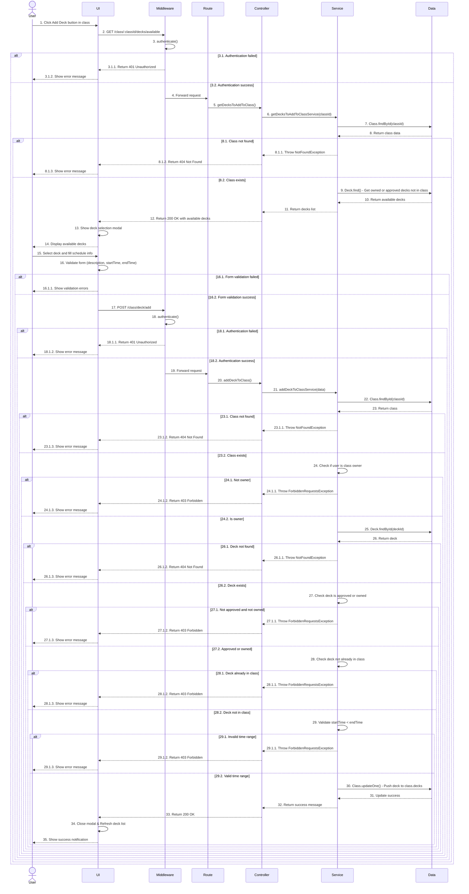

# Add Deck To Class - Sequence Diagram

```mermaid
sequenceDiagram
    actor User
    participant UI
    participant Middleware
    participant Route
    participant Controller
    participant Service
    participant Data

    User->>UI: 1. Click Add Deck button in class
    UI->>Middleware: 2. GET /class/:classId/decks/available
    Middleware->>Middleware: 3. authenticate()

    alt 3.1. Authentication failed
        Middleware-->>UI: 3.1.1. Return 401 Unauthorized
        UI-->>User: 3.1.2. Show error message
    else 3.2. Authentication success
        Middleware->>Route: 4. Forward request
        Route->>Controller: 5. getDecksToAddToClass()
        Controller->>Service: 6. getDecksToAddToClassService(classId)
        Service->>Data: 7. Class.findById(classId)
        Data-->>Service: 8. Return class data

        alt 8.1. Class not found
            Service-->>Controller: 8.1.1. Throw NotFoundException
            Controller-->>UI: 8.1.2. Return 404 Not Found
            UI-->>User: 8.1.3. Show error message
        else 8.2. Class exists
            Service->>Data: 9. Deck.find() - Get owned or approved decks not in class
            Data-->>Service: 10. Return available decks
            Service-->>Controller: 11. Return decks list
            Controller-->>UI: 12. Return 200 OK with available decks
            UI->>UI: 13. Show deck selection modal
            UI-->>User: 14. Display available decks

            User->>UI: 15. Select deck and fill schedule info
            UI->>UI: 16. Validate form (description, startTime, endTime)

            alt 16.1. Form validation failed
                UI-->>User: 16.1.1. Show validation errors
            else 16.2. Form validation success
                UI->>Middleware: 17. POST /class/deck/add
                Middleware->>Middleware: 18. authenticate()

                alt 18.1. Authentication failed
                    Middleware-->>UI: 18.1.1. Return 401 Unauthorized
                    UI-->>User: 18.1.2. Show error message
                else 18.2. Authentication success
                    Middleware->>Route: 19. Forward request
                    Route->>Controller: 20. addDeckToClass()
                    Controller->>Service: 21. addDeckToClassService(data)
                    Service->>Data: 22. Class.findById(classId)
                    Data-->>Service: 23. Return class

                    alt 23.1. Class not found
                        Service-->>Controller: 23.1.1. Throw NotFoundException
                        Controller-->>UI: 23.1.2. Return 404 Not Found
                        UI-->>User: 23.1.3. Show error message
                    else 23.2. Class exists
                        Service->>Service: 24. Check if user is class owner

                        alt 24.1. Not owner
                            Service-->>Controller: 24.1.1. Throw ForbiddenRequestsException
                            Controller-->>UI: 24.1.2. Return 403 Forbidden
                            UI-->>User: 24.1.3. Show error message
                        else 24.2. Is owner
                            Service->>Data: 25. Deck.findById(deckId)
                            Data-->>Service: 26. Return deck

                            alt 26.1. Deck not found
                                Service-->>Controller: 26.1.1. Throw NotFoundException
                                Controller-->>UI: 26.1.2. Return 404 Not Found
                                UI-->>User: 26.1.3. Show error message
                            else 26.2. Deck exists
                                Service->>Service: 27. Check deck is approved or owned

                                alt 27.1. Not approved and not owned
                                    Service-->>Controller: 27.1.1. Throw ForbiddenRequestsException
                                    Controller-->>UI: 27.1.2. Return 403 Forbidden
                                    UI-->>User: 27.1.3. Show error message
                                else 27.2. Approved or owned
                                    Service->>Service: 28. Check deck not already in class

                                    alt 28.1. Deck already in class
                                        Service-->>Controller: 28.1.1. Throw ForbiddenRequestsException
                                        Controller-->>UI: 28.1.2. Return 403 Forbidden
                                        UI-->>User: 28.1.3. Show error message
                                    else 28.2. Deck not in class
                                        Service->>Service: 29. Validate startTime < endTime

                                        alt 29.1. Invalid time range
                                            Service-->>Controller: 29.1.1. Throw ForbiddenRequestsException
                                            Controller-->>UI: 29.1.2. Return 403 Forbidden
                                            UI-->>User: 29.1.3. Show error message
                                        else 29.2. Valid time range
                                            Service->>Data: 30. Class.updateOne() - Push deck to class.decks
                                            Data-->>Service: 31. Update success
                                            Service-->>Controller: 32. Return success message
                                            Controller-->>UI: 33. Return 200 OK
                                            UI->>UI: 34. Close modal & Refresh deck list
                                            UI-->>User: 35. Show success notification
                                        end
                                    end
                                end
                            end
                        end
                    end
                end
            end
        end
    end
```
