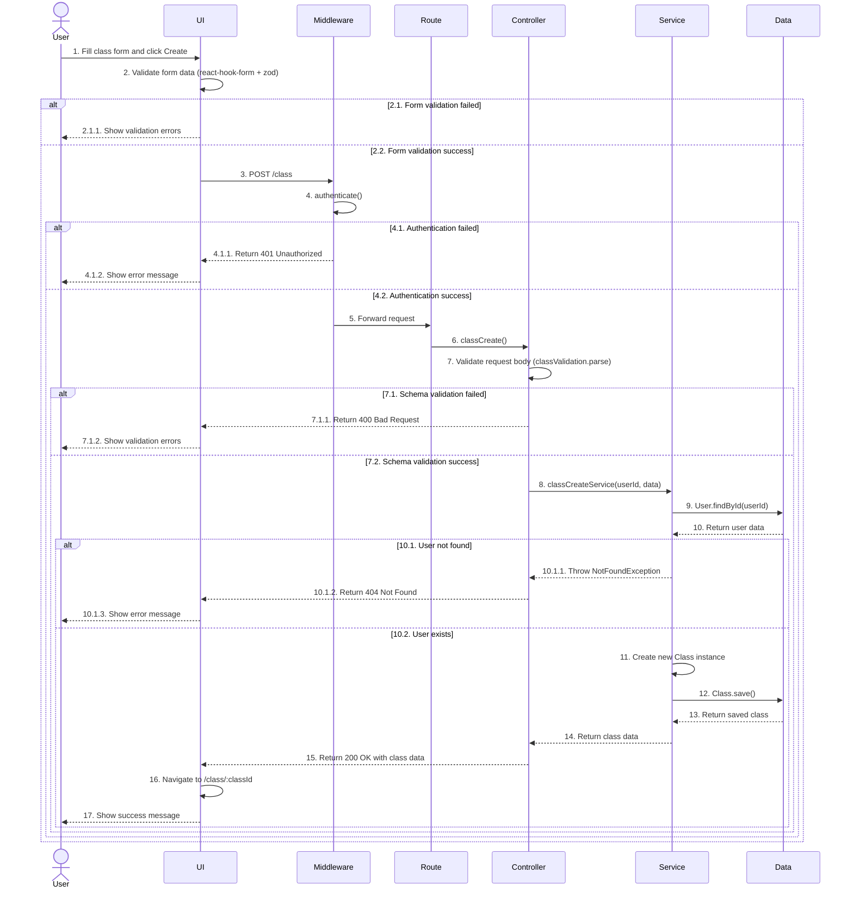

# Create Class - Sequence Diagram

```mermaid
sequenceDiagram
    actor User
    participant UI
    participant Middleware
    participant Route
    participant Controller
    participant Service
    participant Data

    User->>UI: 1. Fill class form and click Create
    UI->>UI: 2. Validate form data (react-hook-form + zod)

    alt 2.1. Form validation failed
        UI-->>User: 2.1.1. Show validation errors
    else 2.2. Form validation success
        UI->>Middleware: 3. POST /class
        Middleware->>Middleware: 4. authenticate()

        alt 4.1. Authentication failed
            Middleware-->>UI: 4.1.1. Return 401 Unauthorized
            UI-->>User: 4.1.2. Show error message
        else 4.2. Authentication success
            Middleware->>Route: 5. Forward request
            Route->>Controller: 6. classCreate()
            Controller->>Controller: 7. Validate request body (classValidation.parse)

            alt 7.1. Schema validation failed
                Controller-->>UI: 7.1.1. Return 400 Bad Request
                UI-->>User: 7.1.2. Show validation errors
            else 7.2. Schema validation success
                Controller->>Service: 8. classCreateService(userId, data)
                Service->>Data: 9. User.findById(userId)
                Data-->>Service: 10. Return user data

                alt 10.1. User not found
                    Service-->>Controller: 10.1.1. Throw NotFoundException
                    Controller-->>UI: 10.1.2. Return 404 Not Found
                    UI-->>User: 10.1.3. Show error message
                else 10.2. User exists
                    Service->>Service: 11. Create new Class instance
                    Service->>Data: 12. Class.save()
                    Data-->>Service: 13. Return saved class
                    Service-->>Controller: 14. Return class data
                    Controller-->>UI: 15. Return 200 OK with class data
                    UI->>UI: 16. Navigate to /class/:classId
                    UI-->>User: 17. Show success message
                end
            end
        end
    end
```
