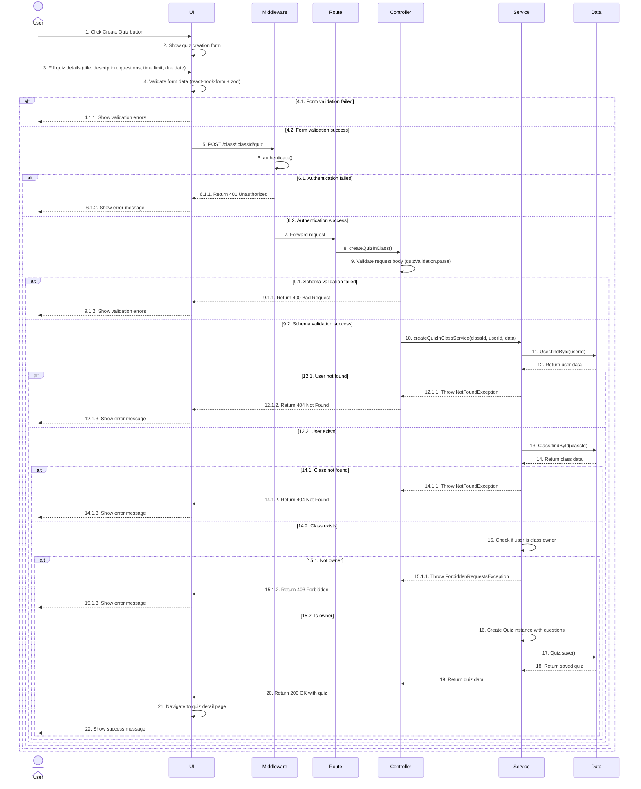

# Create Quiz In Class - Sequence Diagram

```mermaid
sequenceDiagram
    actor User
    participant UI
    participant Middleware
    participant Route
    participant Controller
    participant Service
    participant Data

    User->>UI: 1. Click Create Quiz button
    UI->>UI: 2. Show quiz creation form
    User->>UI: 3. Fill quiz details (title, description, questions, time limit, due date)
    UI->>UI: 4. Validate form data (react-hook-form + zod)

    alt 4.1. Form validation failed
        UI-->>User: 4.1.1. Show validation errors
    else 4.2. Form validation success
        UI->>Middleware: 5. POST /class/:classId/quiz
        Middleware->>Middleware: 6. authenticate()

        alt 6.1. Authentication failed
            Middleware-->>UI: 6.1.1. Return 401 Unauthorized
            UI-->>User: 6.1.2. Show error message
        else 6.2. Authentication success
            Middleware->>Route: 7. Forward request
            Route->>Controller: 8. createQuizInClass()
            Controller->>Controller: 9. Validate request body (quizValidation.parse)

            alt 9.1. Schema validation failed
                Controller-->>UI: 9.1.1. Return 400 Bad Request
                UI-->>User: 9.1.2. Show validation errors
            else 9.2. Schema validation success
                Controller->>Service: 10. createQuizInClassService(classId, userId, data)
                Service->>Data: 11. User.findById(userId)
                Data-->>Service: 12. Return user data

                alt 12.1. User not found
                    Service-->>Controller: 12.1.1. Throw NotFoundException
                    Controller-->>UI: 12.1.2. Return 404 Not Found
                    UI-->>User: 12.1.3. Show error message
                else 12.2. User exists
                    Service->>Data: 13. Class.findById(classId)
                    Data-->>Service: 14. Return class data

                    alt 14.1. Class not found
                        Service-->>Controller: 14.1.1. Throw NotFoundException
                        Controller-->>UI: 14.1.2. Return 404 Not Found
                        UI-->>User: 14.1.3. Show error message
                    else 14.2. Class exists
                        Service->>Service: 15. Check if user is class owner

                        alt 15.1. Not owner
                            Service-->>Controller: 15.1.1. Throw ForbiddenRequestsException
                            Controller-->>UI: 15.1.2. Return 403 Forbidden
                            UI-->>User: 15.1.3. Show error message
                        else 15.2. Is owner
                            Service->>Service: 16. Create Quiz instance with questions
                            Service->>Data: 17. Quiz.save()
                            Data-->>Service: 18. Return saved quiz
                            Service-->>Controller: 19. Return quiz data
                            Controller-->>UI: 20. Return 200 OK with quiz
                            UI->>UI: 21. Navigate to quiz detail page
                            UI-->>User: 22. Show success message
                        end
                    end
                end
            end
        end
    end
```
