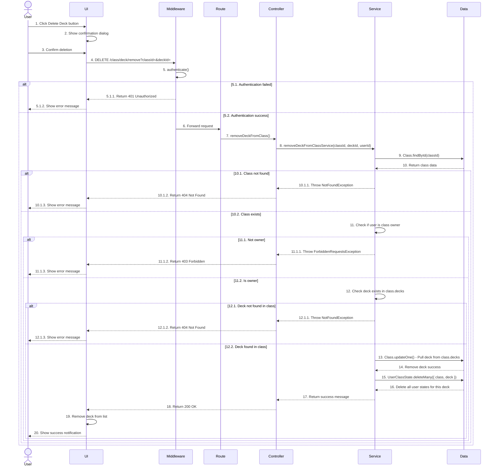

# Delete Decks In Class - Sequence Diagram

```mermaid
sequenceDiagram
    actor User
    participant UI
    participant Middleware
    participant Route
    participant Controller
    participant Service
    participant Data

    User->>UI: 1. Click Delete Deck button
    UI->>UI: 2. Show confirmation dialog
    User->>UI: 3. Confirm deletion
    UI->>Middleware: 4. DELETE /class/deck/remove?classId=&deckId=
    Middleware->>Middleware: 5. authenticate()

    alt 5.1. Authentication failed
        Middleware-->>UI: 5.1.1. Return 401 Unauthorized
        UI-->>User: 5.1.2. Show error message
    else 5.2. Authentication success
        Middleware->>Route: 6. Forward request
        Route->>Controller: 7. removeDeckFromClass()
        Controller->>Service: 8. removeDeckFromClassService(classId, deckId, userId)
        Service->>Data: 9. Class.findById(classId)
        Data-->>Service: 10. Return class data

        alt 10.1. Class not found
            Service-->>Controller: 10.1.1. Throw NotFoundException
            Controller-->>UI: 10.1.2. Return 404 Not Found
            UI-->>User: 10.1.3. Show error message
        else 10.2. Class exists
            Service->>Service: 11. Check if user is class owner

            alt 11.1. Not owner
                Service-->>Controller: 11.1.1. Throw ForbiddenRequestsException
                Controller-->>UI: 11.1.2. Return 403 Forbidden
                UI-->>User: 11.1.3. Show error message
            else 11.2. Is owner
                Service->>Service: 12. Check deck exists in class.decks

                alt 12.1. Deck not found in class
                    Service-->>Controller: 12.1.1. Throw NotFoundException
                    Controller-->>UI: 12.1.2. Return 404 Not Found
                    UI-->>User: 12.1.3. Show error message
                else 12.2. Deck found in class
                    Service->>Data: 13. Class.updateOne() - Pull deck from class.decks
                    Data-->>Service: 14. Remove deck success
                    Service->>Data: 15. UserClassState.deleteMany({ class, deck })
                    Data-->>Service: 16. Delete all user states for this deck
                    Service-->>Controller: 17. Return success message
                    Controller-->>UI: 18. Return 200 OK
                    UI->>UI: 19. Remove deck from list
                    UI-->>User: 20. Show success notification
                end
            end
        end
    end
```
