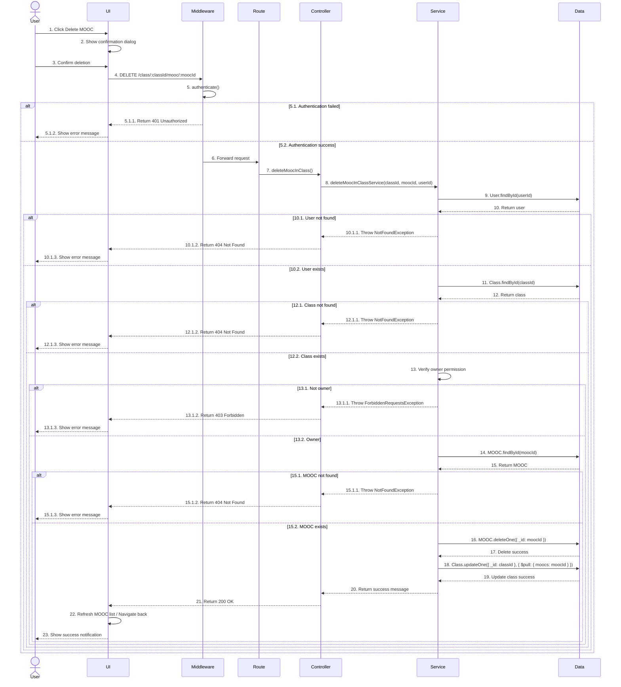

# Delete MOOC - Sequence Diagram

```mermaid
sequenceDiagram
    actor User
    participant UI
    participant Middleware
    participant Route
    participant Controller
    participant Service
    participant Data

    User->>UI: 1. Click Delete MOOC
    UI->>UI: 2. Show confirmation dialog
    User->>UI: 3. Confirm deletion
    UI->>Middleware: 4. DELETE /class/:classId/mooc/:moocId
    Middleware->>Middleware: 5. authenticate()

    alt 5.1. Authentication failed
        Middleware-->>UI: 5.1.1. Return 401 Unauthorized
        UI-->>User: 5.1.2. Show error message
    else 5.2. Authentication success
        Middleware->>Route: 6. Forward request
        Route->>Controller: 7. deleteMoocInClass()
        Controller->>Service: 8. deleteMoocInClassService(classId, moocId, userId)

        Service->>Data: 9. User.findById(userId)
        Data-->>Service: 10. Return user

        alt 10.1. User not found
            Service-->>Controller: 10.1.1. Throw NotFoundException
            Controller-->>UI: 10.1.2. Return 404 Not Found
            UI-->>User: 10.1.3. Show error message
        else 10.2. User exists
            Service->>Data: 11. Class.findById(classId)
            Data-->>Service: 12. Return class

            alt 12.1. Class not found
                Service-->>Controller: 12.1.1. Throw NotFoundException
                Controller-->>UI: 12.1.2. Return 404 Not Found
                UI-->>User: 12.1.3. Show error message
            else 12.2. Class exists
                Service->>Service: 13. Verify owner permission

                alt 13.1. Not owner
                    Service-->>Controller: 13.1.1. Throw ForbiddenRequestsException
                    Controller-->>UI: 13.1.2. Return 403 Forbidden
                    UI-->>User: 13.1.3. Show error message
                else 13.2. Owner
                    Service->>Data: 14. MOOC.findById(moocId)
                    Data-->>Service: 15. Return MOOC

                    alt 15.1. MOOC not found
                        Service-->>Controller: 15.1.1. Throw NotFoundException
                        Controller-->>UI: 15.1.2. Return 404 Not Found
                        UI-->>User: 15.1.3. Show error message
                    else 15.2. MOOC exists
                        Service->>Data: 16. MOOC.deleteOne({ _id: moocId })
                        Data-->>Service: 17. Delete success
                        Service->>Data: 18. Class.updateOne({ _id: classId }, { $pull: { moocs: moocId } })
                        Data-->>Service: 19. Update class success
                        Service-->>Controller: 20. Return success message
                        Controller-->>UI: 21. Return 200 OK
                        UI->>UI: 22. Refresh MOOC list / Navigate back
                        UI-->>User: 23. Show success notification
                    end
                end
            end
        end
    end
```
