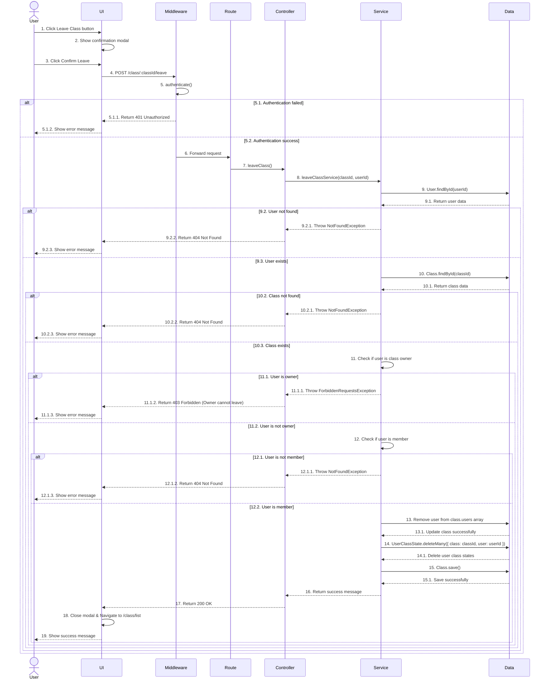

# Leave Class - Sequence Diagram

```mermaid
sequenceDiagram
    actor User
    participant UI
    participant Middleware
    participant Route
    participant Controller
    participant Service
    participant Data

    User->>UI: 1. Click Leave Class button
    UI->>UI: 2. Show confirmation modal

    User->>UI: 3. Click Confirm Leave
    UI->>Middleware: 4. POST /class/:classId/leave

    Middleware->>Middleware: 5. authenticate()

    alt 5.1. Authentication failed
        Middleware-->>UI: 5.1.1. Return 401 Unauthorized
        UI-->>User: 5.1.2. Show error message
    else 5.2. Authentication success
        Middleware->>Route: 6. Forward request
        Route->>Controller: 7. leaveClass()
        Controller->>Service: 8. leaveClassService(classId, userId)

        Service->>Data: 9. User.findById(userId)
        Data-->>Service: 9.1. Return user data

        alt 9.2. User not found
            Service-->>Controller: 9.2.1. Throw NotFoundException
            Controller-->>UI: 9.2.2. Return 404 Not Found
            UI-->>User: 9.2.3. Show error message
        else 9.3. User exists
            Service->>Data: 10. Class.findById(classId)
            Data-->>Service: 10.1. Return class data

            alt 10.2. Class not found
                Service-->>Controller: 10.2.1. Throw NotFoundException
                Controller-->>UI: 10.2.2. Return 404 Not Found
                UI-->>User: 10.2.3. Show error message
            else 10.3. Class exists
                Service->>Service: 11. Check if user is class owner

                alt 11.1. User is owner
                    Service-->>Controller: 11.1.1. Throw ForbiddenRequestsException
                    Controller-->>UI: 11.1.2. Return 403 Forbidden (Owner cannot leave)
                    UI-->>User: 11.1.3. Show error message
                else 11.2. User is not owner
                    Service->>Service: 12. Check if user is member

                    alt 12.1. User is not member
                        Service-->>Controller: 12.1.1. Throw NotFoundException
                        Controller-->>UI: 12.1.2. Return 404 Not Found
                        UI-->>User: 12.1.3. Show error message
                    else 12.2. User is member
                        Service->>Data: 13. Remove user from class.users array
                        Data-->>Service: 13.1. Update class successfully

                        Service->>Data: 14. UserClassState.deleteMany({ class: classId, user: userId })
                        Data-->>Service: 14.1. Delete user class states

                        Service->>Data: 15. Class.save()
                        Data-->>Service: 15.1. Save successfully

                        Service-->>Controller: 16. Return success message
                        Controller-->>UI: 17. Return 200 OK
                        UI->>UI: 18. Close modal & Navigate to /class/list
                        UI-->>User: 19. Show success message
                    end
                end
            end
        end
    end
```
