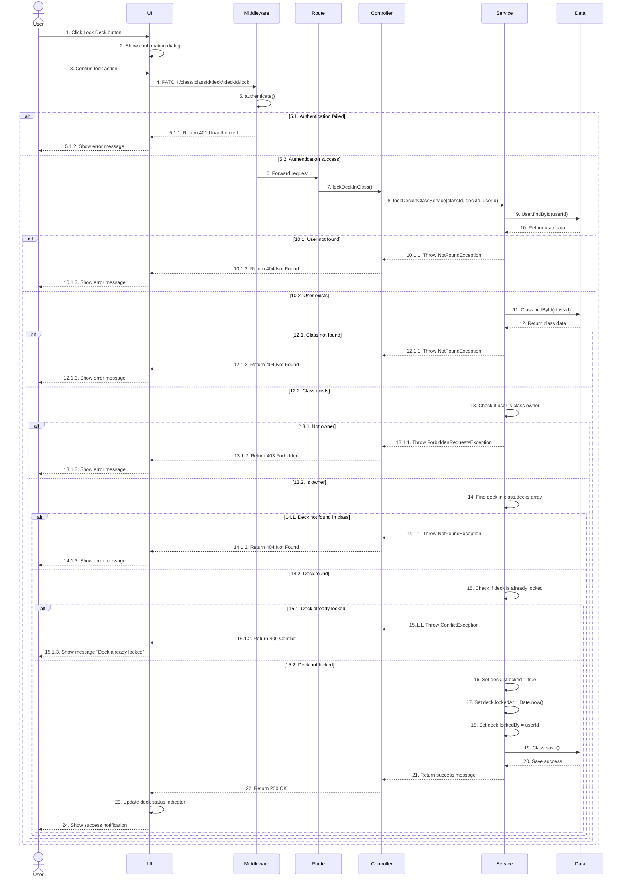

# Lock Deck In Class - Sequence Diagram

```mermaid
sequenceDiagram
    actor User
    participant UI
    participant Middleware
    participant Route
    participant Controller
    participant Service
    participant Data

    User->>UI: 1. Click Lock Deck button
    UI->>UI: 2. Show confirmation dialog
    User->>UI: 3. Confirm lock action
    UI->>Middleware: 4. PATCH /class/:classId/deck/:deckId/lock
    Middleware->>Middleware: 5. authenticate()

    alt 5.1. Authentication failed
        Middleware-->>UI: 5.1.1. Return 401 Unauthorized
        UI-->>User: 5.1.2. Show error message
    else 5.2. Authentication success
        Middleware->>Route: 6. Forward request
        Route->>Controller: 7. lockDeckInClass()
        Controller->>Service: 8. lockDeckInClassService(classId, deckId, userId)
        Service->>Data: 9. User.findById(userId)
        Data-->>Service: 10. Return user data

        alt 10.1. User not found
            Service-->>Controller: 10.1.1. Throw NotFoundException
            Controller-->>UI: 10.1.2. Return 404 Not Found
            UI-->>User: 10.1.3. Show error message
        else 10.2. User exists
            Service->>Data: 11. Class.findById(classId)
            Data-->>Service: 12. Return class data

            alt 12.1. Class not found
                Service-->>Controller: 12.1.1. Throw NotFoundException
                Controller-->>UI: 12.1.2. Return 404 Not Found
                UI-->>User: 12.1.3. Show error message
            else 12.2. Class exists
                Service->>Service: 13. Check if user is class owner

                alt 13.1. Not owner
                    Service-->>Controller: 13.1.1. Throw ForbiddenRequestsException
                    Controller-->>UI: 13.1.2. Return 403 Forbidden
                    UI-->>User: 13.1.3. Show error message
                else 13.2. Is owner
                    Service->>Service: 14. Find deck in class.decks array

                    alt 14.1. Deck not found in class
                        Service-->>Controller: 14.1.1. Throw NotFoundException
                        Controller-->>UI: 14.1.2. Return 404 Not Found
                        UI-->>User: 14.1.3. Show error message
                    else 14.2. Deck found
                        Service->>Service: 15. Check if deck is already locked

                        alt 15.1. Deck already locked
                            Service-->>Controller: 15.1.1. Throw ConflictException
                            Controller-->>UI: 15.1.2. Return 409 Conflict
                            UI-->>User: 15.1.3. Show message "Deck already locked"
                        else 15.2. Deck not locked
                            Service->>Service: 16. Set deck.isLocked = true
                            Service->>Service: 17. Set deck.lockedAt = Date.now()
                            Service->>Service: 18. Set deck.lockedBy = userId
                            Service->>Data: 19. Class.save()
                            Data-->>Service: 20. Save success
                            Service-->>Controller: 21. Return success message
                            Controller-->>UI: 22. Return 200 OK
                            UI->>UI: 23. Update deck status indicator
                            UI-->>User: 24. Show success notification
                        end
                    end
                end
            end
        end
    end
```
