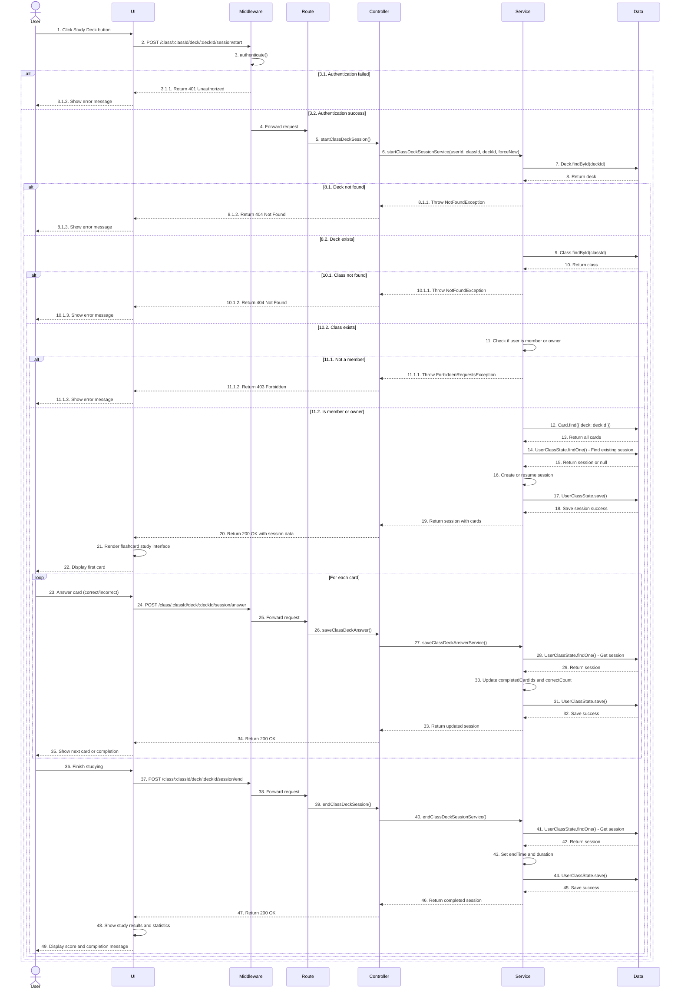

# Study Deck in Class - Sequence Diagram

```mermaid
sequenceDiagram
    actor User
    participant UI
    participant Middleware
    participant Route
    participant Controller
    participant Service
    participant Data

    User->>UI: 1. Click Study Deck button
    UI->>Middleware: 2. POST /class/:classId/deck/:deckId/session/start
    Middleware->>Middleware: 3. authenticate()

    alt 3.1. Authentication failed
        Middleware-->>UI: 3.1.1. Return 401 Unauthorized
        UI-->>User: 3.1.2. Show error message
    else 3.2. Authentication success
        Middleware->>Route: 4. Forward request
        Route->>Controller: 5. startClassDeckSession()
        Controller->>Service: 6. startClassDeckSessionService(userId, classId, deckId, forceNew)
        Service->>Data: 7. Deck.findById(deckId)
        Data-->>Service: 8. Return deck

        alt 8.1. Deck not found
            Service-->>Controller: 8.1.1. Throw NotFoundException
            Controller-->>UI: 8.1.2. Return 404 Not Found
            UI-->>User: 8.1.3. Show error message
        else 8.2. Deck exists
            Service->>Data: 9. Class.findById(classId)
            Data-->>Service: 10. Return class

            alt 10.1. Class not found
                Service-->>Controller: 10.1.1. Throw NotFoundException
                Controller-->>UI: 10.1.2. Return 404 Not Found
                UI-->>User: 10.1.3. Show error message
            else 10.2. Class exists
                Service->>Service: 11. Check if user is member or owner

                alt 11.1. Not a member
                    Service-->>Controller: 11.1.1. Throw ForbiddenRequestsException
                    Controller-->>UI: 11.1.2. Return 403 Forbidden
                    UI-->>User: 11.1.3. Show error message
                else 11.2. Is member or owner
                    Service->>Data: 12. Card.find({ deck: deckId })
                    Data-->>Service: 13. Return all cards
                    Service->>Data: 14. UserClassState.findOne() - Find existing session
                    Data-->>Service: 15. Return session or null
                    Service->>Service: 16. Create or resume session
                    Service->>Data: 17. UserClassState.save()
                    Data-->>Service: 18. Save session success
                    Service-->>Controller: 19. Return session with cards
                    Controller-->>UI: 20. Return 200 OK with session data
                    UI->>UI: 21. Render flashcard study interface
                    UI-->>User: 22. Display first card

                    loop For each card
                        User->>UI: 23. Answer card (correct/incorrect)
                        UI->>Middleware: 24. POST /class/:classId/deck/:deckId/session/answer
                        Middleware->>Route: 25. Forward request
                        Route->>Controller: 26. saveClassDeckAnswer()
                        Controller->>Service: 27. saveClassDeckAnswerService()
                        Service->>Data: 28. UserClassState.findOne() - Get session
                        Data-->>Service: 29. Return session
                        Service->>Service: 30. Update completedCardIds and correctCount
                        Service->>Data: 31. UserClassState.save()
                        Data-->>Service: 32. Save success
                        Service-->>Controller: 33. Return updated session
                        Controller-->>UI: 34. Return 200 OK
                        UI-->>User: 35. Show next card or completion
                    end

                    User->>UI: 36. Finish studying
                    UI->>Middleware: 37. POST /class/:classId/deck/:deckId/session/end
                    Middleware->>Route: 38. Forward request
                    Route->>Controller: 39. endClassDeckSession()
                    Controller->>Service: 40. endClassDeckSessionService()
                    Service->>Data: 41. UserClassState.findOne() - Get session
                    Data-->>Service: 42. Return session
                    Service->>Service: 43. Set endTime and duration
                    Service->>Data: 44. UserClassState.save()
                    Data-->>Service: 45. Save success
                    Service-->>Controller: 46. Return completed session
                    Controller-->>UI: 47. Return 200 OK
                    UI->>UI: 48. Show study results and statistics
                    UI-->>User: 49. Display score and completion message
                end
            end
        end
    end
```
