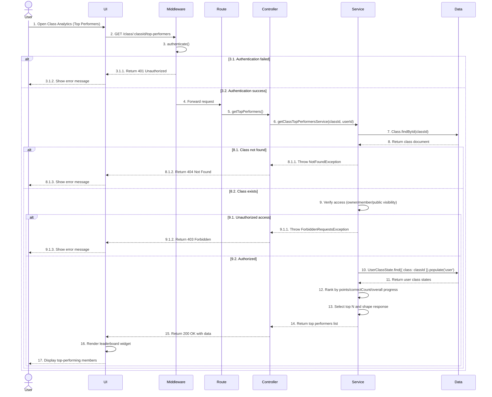

# Track Top Performers in Class - Sequence Diagram

```mermaid
sequenceDiagram
    actor User
    participant UI
    participant Middleware
    participant Route
    participant Controller
    participant Service
    participant Data

    User->>UI: 1. Open Class Analytics (Top Performers)
    UI->>Middleware: 2. GET /class/:classId/top-performers
    Middleware->>Middleware: 3. authenticate()

    alt 3.1. Authentication failed
        Middleware-->>UI: 3.1.1. Return 401 Unauthorized
        UI-->>User: 3.1.2. Show error message
    else 3.2. Authentication success
        Middleware->>Route: 4. Forward request
        Route->>Controller: 5. getTopPerformers()
        Controller->>Service: 6. getClassTopPerformersService(classId, userId)

        Service->>Data: 7. Class.findById(classId)
        Data-->>Service: 8. Return class document

        alt 8.1. Class not found
            Service-->>Controller: 8.1.1. Throw NotFoundException
            Controller-->>UI: 8.1.2. Return 404 Not Found
            UI-->>User: 8.1.3. Show error message
        else 8.2. Class exists
            Service->>Service: 9. Verify access (owner/member/public visibility)

            alt 9.1. Unauthorized access
                Service-->>Controller: 9.1.1. Throw ForbiddenRequestsException
                Controller-->>UI: 9.1.2. Return 403 Forbidden
                UI-->>User: 9.1.3. Show error message
            else 9.2. Authorized
                Service->>Data: 10. UserClassState.find({ class: classId }).populate('user')
                Data-->>Service: 11. Return user class states

                Service->>Service: 12. Rank by points/correctCount/overall progress
                Service->>Service: 13. Select top N and shape response
                Service-->>Controller: 14. Return top performers list
                Controller-->>UI: 15. Return 200 OK with data
                UI->>UI: 16. Render leaderboard widget
                UI-->>User: 17. Display top-performing members
            end
        end
    end
```
