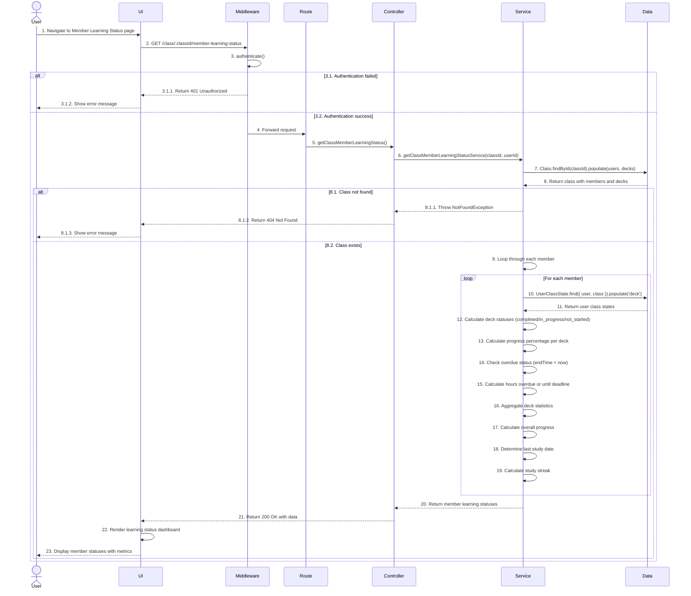

# Tracking Status Learning Member In Class - Sequence Diagram

```mermaid
sequenceDiagram
    actor User
    participant UI
    participant Middleware
    participant Route
    participant Controller
    participant Service
    participant Data

    User->>UI: 1. Navigate to Member Learning Status page
    UI->>Middleware: 2. GET /class/:classId/member-learning-status
    Middleware->>Middleware: 3. authenticate()

    alt 3.1. Authentication failed
        Middleware-->>UI: 3.1.1. Return 401 Unauthorized
        UI-->>User: 3.1.2. Show error message
    else 3.2. Authentication success
        Middleware->>Route: 4. Forward request
        Route->>Controller: 5. getClassMemberLearningStatus()
        Controller->>Service: 6. getClassMemberLearningStatusService(classId, userId)
        Service->>Data: 7. Class.findById(classId).populate(users, decks)
        Data-->>Service: 8. Return class with members and decks

        alt 8.1. Class not found
            Service-->>Controller: 8.1.1. Throw NotFoundException
            Controller-->>UI: 8.1.2. Return 404 Not Found
            UI-->>User: 8.1.3. Show error message
        else 8.2. Class exists
            Service->>Service: 9. Loop through each member

            loop For each member
                Service->>Data: 10. UserClassState.find({ user, class }).populate('deck')
                Data-->>Service: 11. Return user class states
                Service->>Service: 12. Calculate deck statuses (completed/in_progress/not_started)
                Service->>Service: 13. Calculate progress percentage per deck
                Service->>Service: 14. Check overdue status (endTime < now)
                Service->>Service: 15. Calculate hours overdue or until deadline
                Service->>Service: 16. Aggregate deck statistics
                Service->>Service: 17. Calculate overall progress
                Service->>Service: 18. Determine last study date
                Service->>Service: 19. Calculate study streak
            end

            Service-->>Controller: 20. Return member learning statuses
            Controller-->>UI: 21. Return 200 OK with data
            UI->>UI: 22. Render learning status dashboard
            UI-->>User: 23. Display member statuses with metrics
        end
    end
```
