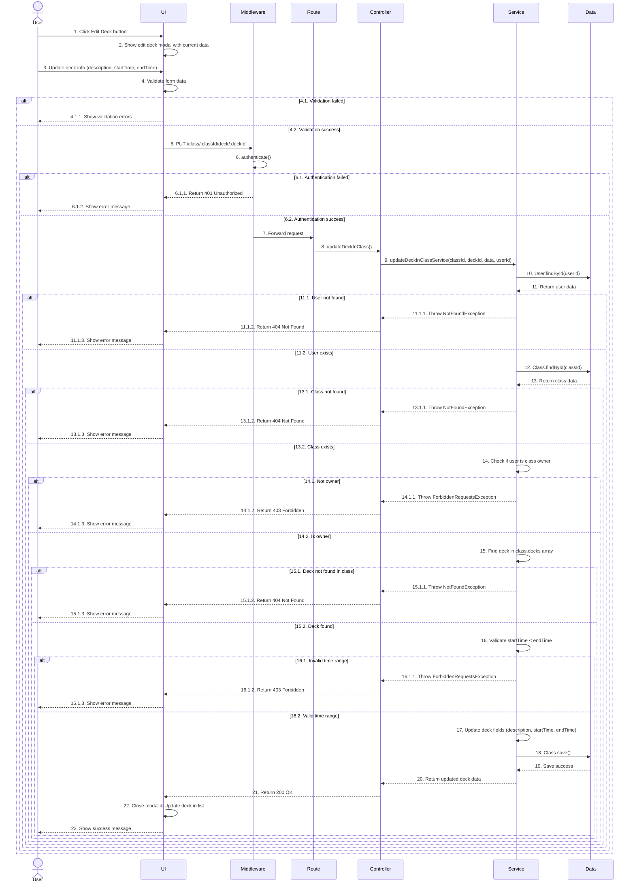

# Update Decks In Class - Sequence Diagram

```mermaid
sequenceDiagram
    actor User
    participant UI
    participant Middleware
    participant Route
    participant Controller
    participant Service
    participant Data

    User->>UI: 1. Click Edit Deck button
    UI->>UI: 2. Show edit deck modal with current data
    User->>UI: 3. Update deck info (description, startTime, endTime)
    UI->>UI: 4. Validate form data

    alt 4.1. Validation failed
        UI-->>User: 4.1.1. Show validation errors
    else 4.2. Validation success
        UI->>Middleware: 5. PUT /class/:classId/deck/:deckId
        Middleware->>Middleware: 6. authenticate()

        alt 6.1. Authentication failed
            Middleware-->>UI: 6.1.1. Return 401 Unauthorized
            UI-->>User: 6.1.2. Show error message
        else 6.2. Authentication success
            Middleware->>Route: 7. Forward request
            Route->>Controller: 8. updateDeckInClass()
            Controller->>Service: 9. updateDeckInClassService(classId, deckId, data, userId)
            Service->>Data: 10. User.findById(userId)
            Data-->>Service: 11. Return user data

            alt 11.1. User not found
                Service-->>Controller: 11.1.1. Throw NotFoundException
                Controller-->>UI: 11.1.2. Return 404 Not Found
                UI-->>User: 11.1.3. Show error message
            else 11.2. User exists
                Service->>Data: 12. Class.findById(classId)
                Data-->>Service: 13. Return class data

                alt 13.1. Class not found
                    Service-->>Controller: 13.1.1. Throw NotFoundException
                    Controller-->>UI: 13.1.2. Return 404 Not Found
                    UI-->>User: 13.1.3. Show error message
                else 13.2. Class exists
                    Service->>Service: 14. Check if user is class owner

                    alt 14.1. Not owner
                        Service-->>Controller: 14.1.1. Throw ForbiddenRequestsException
                        Controller-->>UI: 14.1.2. Return 403 Forbidden
                        UI-->>User: 14.1.3. Show error message
                    else 14.2. Is owner
                        Service->>Service: 15. Find deck in class.decks array

                        alt 15.1. Deck not found in class
                            Service-->>Controller: 15.1.1. Throw NotFoundException
                            Controller-->>UI: 15.1.2. Return 404 Not Found
                            UI-->>User: 15.1.3. Show error message
                        else 15.2. Deck found
                            Service->>Service: 16. Validate startTime < endTime

                            alt 16.1. Invalid time range
                                Service-->>Controller: 16.1.1. Throw ForbiddenRequestsException
                                Controller-->>UI: 16.1.2. Return 403 Forbidden
                                UI-->>User: 16.1.3. Show error message
                            else 16.2. Valid time range
                                Service->>Service: 17. Update deck fields (description, startTime, endTime)
                                Service->>Data: 18. Class.save()
                                Data-->>Service: 19. Save success
                                Service-->>Controller: 20. Return updated deck data
                                Controller-->>UI: 21. Return 200 OK
                                UI->>UI: 22. Close modal & Update deck in list
                                UI-->>User: 23. Show success message
                            end
                        end
                    end
                end
            end
        end
    end
```
