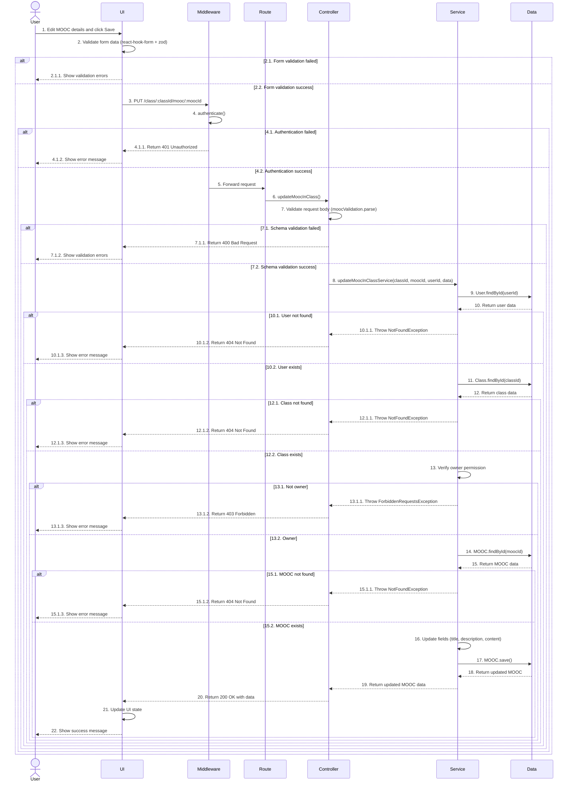

# Update MOOC in Class - Sequence Diagram

```mermaid
sequenceDiagram
    actor User
    participant UI
    participant Middleware
    participant Route
    participant Controller
    participant Service
    participant Data

    User->>UI: 1. Edit MOOC details and click Save
    UI->>UI: 2. Validate form data (react-hook-form + zod)

    alt 2.1. Form validation failed
        UI-->>User: 2.1.1. Show validation errors
    else 2.2. Form validation success
        UI->>Middleware: 3. PUT /class/:classId/mooc/:moocId
        Middleware->>Middleware: 4. authenticate()

        alt 4.1. Authentication failed
            Middleware-->>UI: 4.1.1. Return 401 Unauthorized
            UI-->>User: 4.1.2. Show error message
        else 4.2. Authentication success
            Middleware->>Route: 5. Forward request
            Route->>Controller: 6. updateMoocInClass()
            Controller->>Controller: 7. Validate request body (moocValidation.parse)

            alt 7.1. Schema validation failed
                Controller-->>UI: 7.1.1. Return 400 Bad Request
                UI-->>User: 7.1.2. Show validation errors
            else 7.2. Schema validation success
                Controller->>Service: 8. updateMoocInClassService(classId, moocId, userId, data)
                Service->>Data: 9. User.findById(userId)
                Data-->>Service: 10. Return user data

                alt 10.1. User not found
                    Service-->>Controller: 10.1.1. Throw NotFoundException
                    Controller-->>UI: 10.1.2. Return 404 Not Found
                    UI-->>User: 10.1.3. Show error message
                else 10.2. User exists
                    Service->>Data: 11. Class.findById(classId)
                    Data-->>Service: 12. Return class data

                    alt 12.1. Class not found
                        Service-->>Controller: 12.1.1. Throw NotFoundException
                        Controller-->>UI: 12.1.2. Return 404 Not Found
                        UI-->>User: 12.1.3. Show error message
                    else 12.2. Class exists
                        Service->>Service: 13. Verify owner permission

                        alt 13.1. Not owner
                            Service-->>Controller: 13.1.1. Throw ForbiddenRequestsException
                            Controller-->>UI: 13.1.2. Return 403 Forbidden
                            UI-->>User: 13.1.3. Show error message
                        else 13.2. Owner
                            Service->>Data: 14. MOOC.findById(moocId)
                            Data-->>Service: 15. Return MOOC data

                            alt 15.1. MOOC not found
                                Service-->>Controller: 15.1.1. Throw NotFoundException
                                Controller-->>UI: 15.1.2. Return 404 Not Found
                                UI-->>User: 15.1.3. Show error message
                            else 15.2. MOOC exists
                                Service->>Service: 16. Update fields (title, description, content)
                                Service->>Data: 17. MOOC.save()
                                Data-->>Service: 18. Return updated MOOC
                                Service-->>Controller: 19. Return updated MOOC data
                                Controller-->>UI: 20. Return 200 OK with data
                                UI->>UI: 21. Update UI state
                                UI-->>User: 22. Show success message
                            end
                        end
                    end
                end
            end
        end
    end
```
