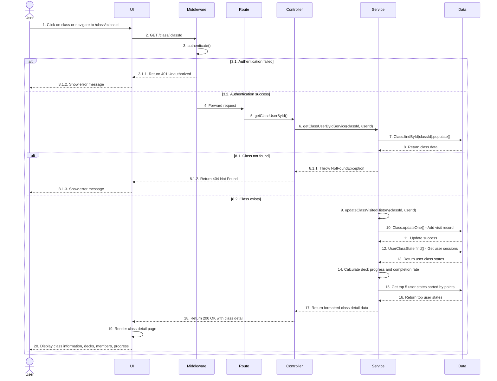

# View Class Detail - Sequence Diagram

```mermaid
sequenceDiagram
    actor User
    participant UI
    participant Middleware
    participant Route
    participant Controller
    participant Service
    participant Data

    User->>UI: 1. Click on class or navigate to /class/:classId
    UI->>Middleware: 2. GET /class/:classId
    Middleware->>Middleware: 3. authenticate()

    alt 3.1. Authentication failed
        Middleware-->>UI: 3.1.1. Return 401 Unauthorized
        UI-->>User: 3.1.2. Show error message
    else 3.2. Authentication success
        Middleware->>Route: 4. Forward request
        Route->>Controller: 5. getClassUserById()
        Controller->>Service: 6. getClassUserByIdService(classId, userId)
        Service->>Data: 7. Class.findById(classId).populate()
        Data-->>Service: 8. Return class data

        alt 8.1. Class not found
            Service-->>Controller: 8.1.1. Throw NotFoundException
            Controller-->>UI: 8.1.2. Return 404 Not Found
            UI-->>User: 8.1.3. Show error message
        else 8.2. Class exists
            Service->>Service: 9. updateClassVisitedHistory(classId, userId)
            Service->>Data: 10. Class.updateOne() - Add visit record
            Data-->>Service: 11. Update success
            Service->>Data: 12. UserClassState.find() - Get user sessions
            Data-->>Service: 13. Return user class states
            Service->>Service: 14. Calculate deck progress and completion rate
            Service->>Data: 15. Get top 5 user states sorted by points
            Data-->>Service: 16. Return top user states
            Service-->>Controller: 17. Return formatted class detail data
            Controller-->>UI: 18. Return 200 OK with class detail
            UI->>UI: 19. Render class detail page
            UI-->>User: 20. Display class information, decks, members, progress
        end
    end
```
