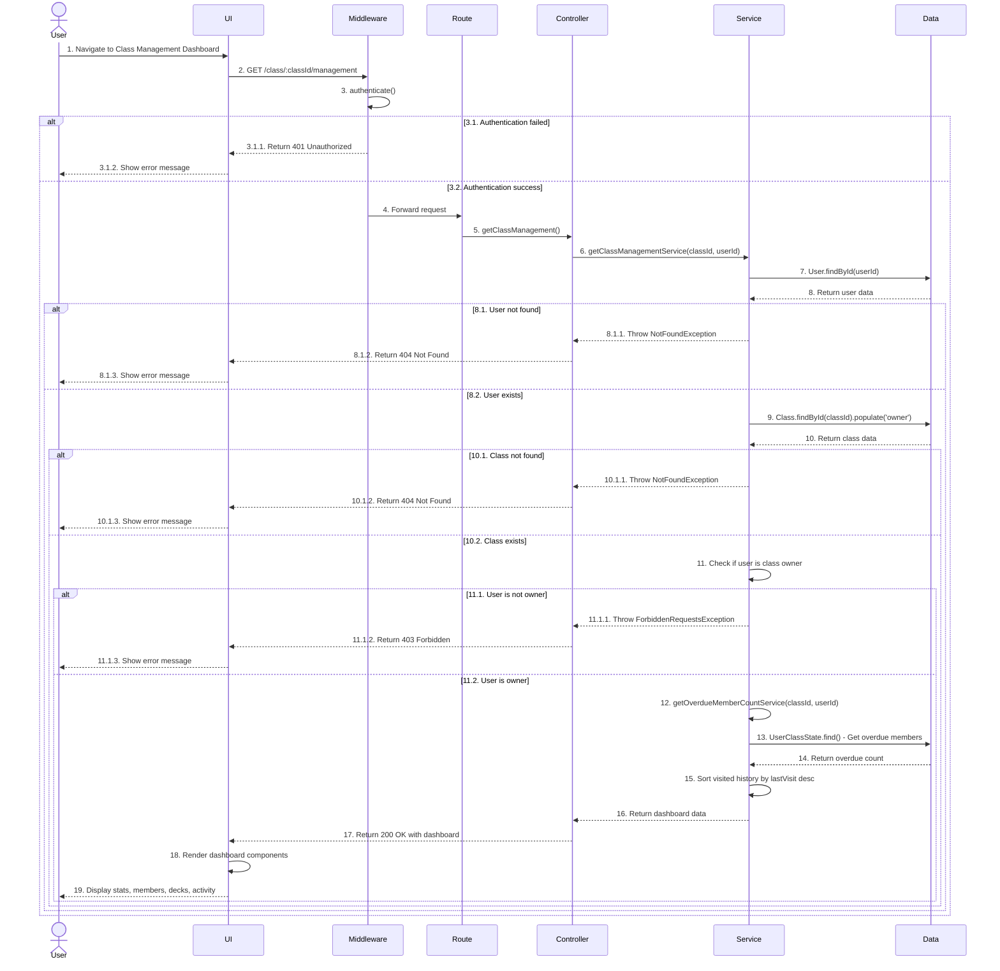

# View Dashboard Class - Sequence Diagram

```mermaid
sequenceDiagram
    actor User
    participant UI
    participant Middleware
    participant Route
    participant Controller
    participant Service
    participant Data

    User->>UI: 1. Navigate to Class Management Dashboard
    UI->>Middleware: 2. GET /class/:classId/management
    Middleware->>Middleware: 3. authenticate()

    alt 3.1. Authentication failed
        Middleware-->>UI: 3.1.1. Return 401 Unauthorized
        UI-->>User: 3.1.2. Show error message
    else 3.2. Authentication success
        Middleware->>Route: 4. Forward request
        Route->>Controller: 5. getClassManagement()
        Controller->>Service: 6. getClassManagementService(classId, userId)
        Service->>Data: 7. User.findById(userId)
        Data-->>Service: 8. Return user data

        alt 8.1. User not found
            Service-->>Controller: 8.1.1. Throw NotFoundException
            Controller-->>UI: 8.1.2. Return 404 Not Found
            UI-->>User: 8.1.3. Show error message
        else 8.2. User exists
            Service->>Data: 9. Class.findById(classId).populate('owner')
            Data-->>Service: 10. Return class data

            alt 10.1. Class not found
                Service-->>Controller: 10.1.1. Throw NotFoundException
                Controller-->>UI: 10.1.2. Return 404 Not Found
                UI-->>User: 10.1.3. Show error message
            else 10.2. Class exists
                Service->>Service: 11. Check if user is class owner

                alt 11.1. User is not owner
                    Service-->>Controller: 11.1.1. Throw ForbiddenRequestsException
                    Controller-->>UI: 11.1.2. Return 403 Forbidden
                    UI-->>User: 11.1.3. Show error message
                else 11.2. User is owner
                    Service->>Service: 12. getOverdueMemberCountService(classId, userId)
                    Service->>Data: 13. UserClassState.find() - Get overdue members
                    Data-->>Service: 14. Return overdue count
                    Service->>Service: 15. Sort visited history by lastVisit desc
                    Service-->>Controller: 16. Return dashboard data
                    Controller-->>UI: 17. Return 200 OK with dashboard
                    UI->>UI: 18. Render dashboard components
                    UI-->>User: 19. Display stats, members, decks, activity
                end
            end
        end
    end
```
