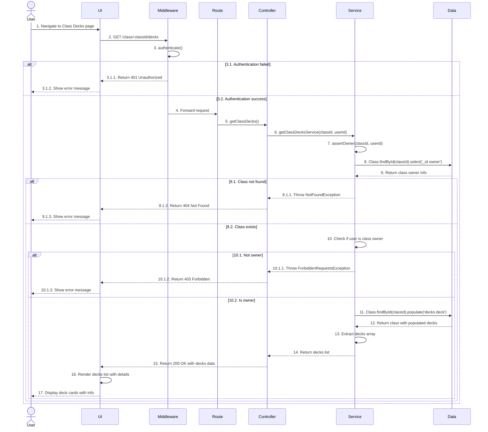

# View Decks In Class - Sequence Diagram

```mermaid
sequenceDiagram
    actor User
    participant UI
    participant Middleware
    participant Route
    participant Controller
    participant Service
    participant Data

    User->>UI: 1. Navigate to Class Decks page
    UI->>Middleware: 2. GET /class/:classId/decks
    Middleware->>Middleware: 3. authenticate()

    alt 3.1. Authentication failed
        Middleware-->>UI: 3.1.1. Return 401 Unauthorized
        UI-->>User: 3.1.2. Show error message
    else 3.2. Authentication success
        Middleware->>Route: 4. Forward request
        Route->>Controller: 5. getClassDecks()
        Controller->>Service: 6. getClassDecksService(classId, userId)
        Service->>Service: 7. assertOwner(classId, userId)
        Service->>Data: 8. Class.findById(classId).select('_id owner')
        Data-->>Service: 9. Return class owner info

        alt 9.1. Class not found
            Service-->>Controller: 9.1.1. Throw NotFoundException
            Controller-->>UI: 9.1.2. Return 404 Not Found
            UI-->>User: 9.1.3. Show error message
        else 9.2. Class exists
            Service->>Service: 10. Check if user is class owner

            alt 10.1. Not owner
                Service-->>Controller: 10.1.1. Throw ForbiddenRequestsException
                Controller-->>UI: 10.1.2. Return 403 Forbidden
                UI-->>User: 10.1.3. Show error message
            else 10.2. Is owner
                Service->>Data: 11. Class.findById(classId).populate('decks.deck')
                Data-->>Service: 12. Return class with populated decks
                Service->>Service: 13. Extract decks array
                Service-->>Controller: 14. Return decks list
                Controller-->>UI: 15. Return 200 OK with decks data
                UI->>UI: 16. Render decks list with details
                UI-->>User: 17. Display deck cards with info
            end
        end
    end
```
