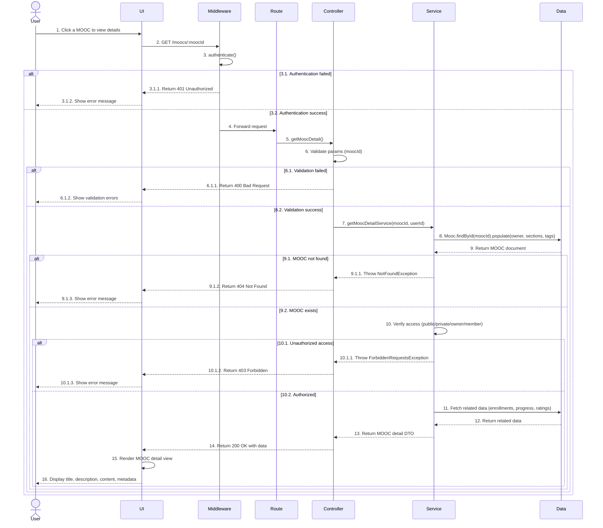

# View MOOC Detail - Sequence Diagram

```mermaid
sequenceDiagram
    actor User
    participant UI
    participant Middleware
    participant Route
    participant Controller
    participant Service
    participant Data

    User->>UI: 1. Click a MOOC to view details
    UI->>Middleware: 2. GET /moocs/:moocId
    Middleware->>Middleware: 3. authenticate()

    alt 3.1. Authentication failed
        Middleware-->>UI: 3.1.1. Return 401 Unauthorized
        UI-->>User: 3.1.2. Show error message
    else 3.2. Authentication success
        Middleware->>Route: 4. Forward request
        Route->>Controller: 5. getMoocDetail()
        Controller->>Controller: 6. Validate params (moocId)

        alt 6.1. Validation failed
            Controller-->>UI: 6.1.1. Return 400 Bad Request
            UI-->>User: 6.1.2. Show validation errors
        else 6.2. Validation success
            Controller->>Service: 7. getMoocDetailService(moocId, userId)
            Service->>Data: 8. Mooc.findById(moocId).populate(owner, sections, tags)
            Data-->>Service: 9. Return MOOC document

            alt 9.1. MOOC not found
                Service-->>Controller: 9.1.1. Throw NotFoundException
                Controller-->>UI: 9.1.2. Return 404 Not Found
                UI-->>User: 9.1.3. Show error message
            else 9.2. MOOC exists
                Service->>Service: 10. Verify access (public/private/owner/member)
                alt 10.1. Unauthorized access
                    Service-->>Controller: 10.1.1. Throw ForbiddenRequestsException
                    Controller-->>UI: 10.1.2. Return 403 Forbidden
                    UI-->>User: 10.1.3. Show error message
                else 10.2. Authorized
                    Service->>Data: 11. Fetch related data (enrollments, progress, ratings)
                    Data-->>Service: 12. Return related data
                    Service-->>Controller: 13. Return MOOC detail DTO
                    Controller-->>UI: 14. Return 200 OK with data
                    UI->>UI: 15. Render MOOC detail view
                    UI-->>User: 16. Display title, description, content, metadata
                end
            end
        end
    end
```
