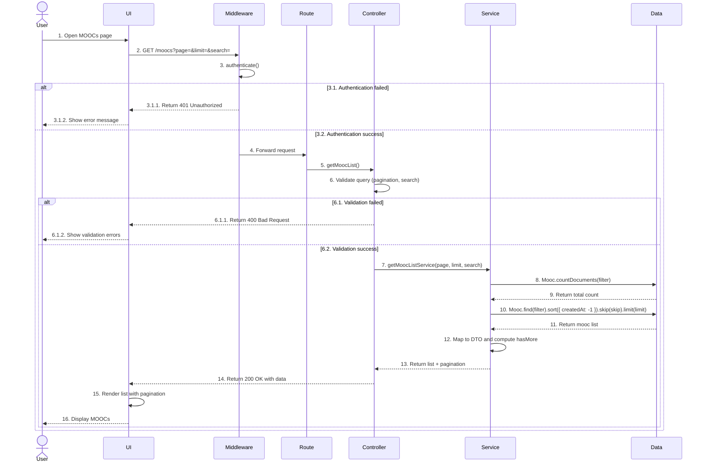

# View MOOC List - Sequence Diagram

```mermaid
sequenceDiagram
    actor User
    participant UI
    participant Middleware
    participant Route
    participant Controller
    participant Service
    participant Data

    User->>UI: 1. Open MOOCs page
    UI->>Middleware: 2. GET /moocs?page=&limit=&search=
    Middleware->>Middleware: 3. authenticate()

    alt 3.1. Authentication failed
        Middleware-->>UI: 3.1.1. Return 401 Unauthorized
        UI-->>User: 3.1.2. Show error message
    else 3.2. Authentication success
        Middleware->>Route: 4. Forward request
        Route->>Controller: 5. getMoocList()
        Controller->>Controller: 6. Validate query (pagination, search)

        alt 6.1. Validation failed
            Controller-->>UI: 6.1.1. Return 400 Bad Request
            UI-->>User: 6.1.2. Show validation errors
        else 6.2. Validation success
            Controller->>Service: 7. getMoocListService(page, limit, search)
            Service->>Data: 8. Mooc.countDocuments(filter)
            Data-->>Service: 9. Return total count
            Service->>Data: 10. Mooc.find(filter).sort({ createdAt: -1 }).skip(skip).limit(limit)
            Data-->>Service: 11. Return mooc list
            Service->>Service: 12. Map to DTO and compute hasMore
            Service-->>Controller: 13. Return list + pagination
            Controller-->>UI: 14. Return 200 OK with data
            UI->>UI: 15. Render list with pagination
            UI-->>User: 16. Display MOOCs
        end
    end
```
