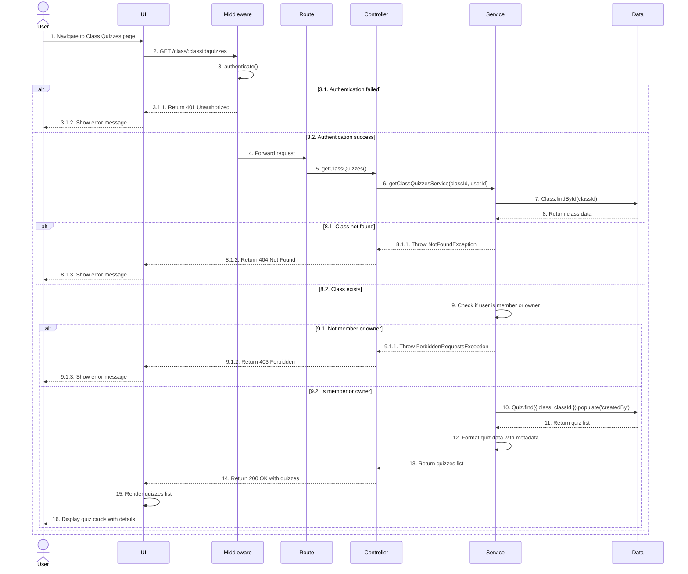

# View Quiz In Class - Sequence Diagram

```mermaid
sequenceDiagram
    actor User
    participant UI
    participant Middleware
    participant Route
    participant Controller
    participant Service
    participant Data

    User->>UI: 1. Navigate to Class Quizzes page
    UI->>Middleware: 2. GET /class/:classId/quizzes
    Middleware->>Middleware: 3. authenticate()

    alt 3.1. Authentication failed
        Middleware-->>UI: 3.1.1. Return 401 Unauthorized
        UI-->>User: 3.1.2. Show error message
    else 3.2. Authentication success
        Middleware->>Route: 4. Forward request
        Route->>Controller: 5. getClassQuizzes()
        Controller->>Service: 6. getClassQuizzesService(classId, userId)
        Service->>Data: 7. Class.findById(classId)
        Data-->>Service: 8. Return class data

        alt 8.1. Class not found
            Service-->>Controller: 8.1.1. Throw NotFoundException
            Controller-->>UI: 8.1.2. Return 404 Not Found
            UI-->>User: 8.1.3. Show error message
        else 8.2. Class exists
            Service->>Service: 9. Check if user is member or owner

            alt 9.1. Not member or owner
                Service-->>Controller: 9.1.1. Throw ForbiddenRequestsException
                Controller-->>UI: 9.1.2. Return 403 Forbidden
                UI-->>User: 9.1.3. Show error message
            else 9.2. Is member or owner
                Service->>Data: 10. Quiz.find({ class: classId }).populate('createdBy')
                Data-->>Service: 11. Return quiz list
                Service->>Service: 12. Format quiz data with metadata
                Service-->>Controller: 13. Return quizzes list
                Controller-->>UI: 14. Return 200 OK with quizzes
                UI->>UI: 15. Render quizzes list
                UI-->>User: 16. Display quiz cards with details
            end
        end
    end
```
